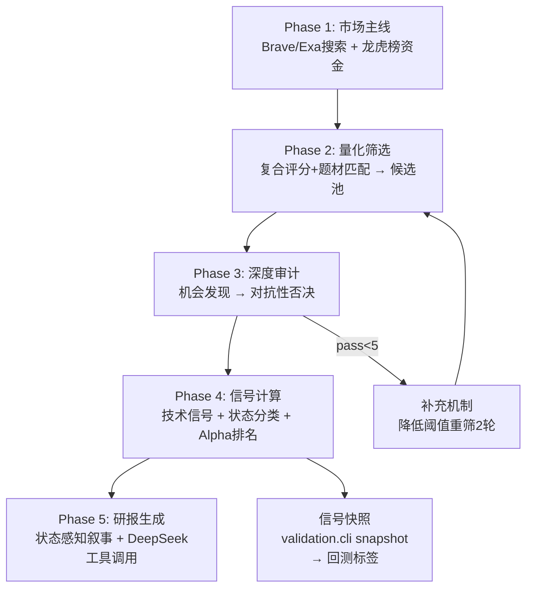

# Contrarian Agent — A股质量筛选 + 回踩低吸投资研究系统

一个**状态感知的**自动化投资研究流水线。策略的核心不再是"趋势跟踪 vs 均值回归"的二选一，而是**先判断市场状态，再选择对应策略**。

---

## 核心哲学：重质、通过滤、待回踩

```
震荡市（80%+时间）→ 箱体下沿低吸，不追高
趋势市（<20%时间） → BOS确认后等小级别回踩，不追突破
```

| 原则 | 含义 | 实现 |
|------|------|------|
| **重质** | 基本面质量是第一道筛子 | 生命周期感知的四维度评分（盈利/成长/财务健康/盈利质量），占复合权重22%，alpha权重27% |
| **通过滤** | 审计级排雷 | 机会发现 → 对抗性否决双重审查，立案/减持/退市/伪概念一票否决，warn股票从最终报告剔除 |
| **待回踩** | 不在突破中买入，在回调中买入 | 5种市场状态分类器 → 状态感知alpha调制 → 箱顶惩罚/回踩奖励 |

---

## 市场状态分类器

IC分析的发现——动量信号全为负——并非"动量永远无用"，而是**震荡市在时间序列中占比80%+，主导了线性IC**。解决方案不是扔掉所有动量信号，而是**先分类状态，再按状态调整策略权重**。

| 状态 | 判定 | Alpha调制 | 报告叙事 |
|------|------|-----------|----------|
| `uptrend` | MA多头 + ADX>30 + BOS确认 | 回踩奖励 0.12× | "趋势结构完好，回踩X ATR，关注均线支撑" |
| `breakout_zone` | pos>0.85 + ignition + 近箱顶 | 追涨惩罚 -0.08× | "【高位】追高风险极大，等待确认信号" |
| `range` | 低ADX + 箱体中部 | 中位奖励 +0.08×（近下沿时）| "箱体X%分位，距下沿X%空间" |
| `bottom_fishing` | pos<0.2 + MA空头或OBV背离 | 低位陷阱惩罚 -0.03× | "【风险】需验证是否基本面恶化" |
| `downtrend` | MA空头 + 价格在均线下 + ADX升 | 下行惩罚 -0.06× | "【风险】下行趋势，回避" |

---

## 架构概览



---

## Phase 1: 市场情报

- **Brave Search API**（主）+ **Exa.ai**（备）— 替代已失效的Zhipu
- **龙虎榜资金分析** — 上榜次数、净买入、资金结构（机构/北上/游资占比）
- **多源融合** — confirmed（双验证）/ web_only / capital_only / weak 四级

---

## Phase 2: 量化筛选

### 复合评分权重

| 成分 | 权重 | 说明 |
|------|:---:|------|
| 盘整质量 | 35% | 低波动 + 区间中低位，IC正向验证 |
| 量能质量 | 18% | 温和放量 > 激进放量 |
| 挤压准备 | 15% | 低波动挤压 → 变盘 |
| 估值质量 | 10% | 低估值正向 |
| 基本面质量 | 22% | 生命周期感知四维度评分（原7%，动量移除后重新分配） |

### 补充机制

审计通过数 < `MIN_PASS_COUNT`（默认5）时，自动触发最多 `MAX_REFILL_ROUNDS`（默认2）轮松弛重筛：

| 参数 | Round 0 | Round 1 | Round 2 |
|------|---------|---------|---------|
| consolidation_score ≥ | 50 | 35 | 20 |
| volume_boost ≥ | 0.5 | 0.3 | 0.0 |
| 技术池上限 | 10 | 15 | 20 |
| 题材池上限 | 100 | 100 | 200 |

---

## Phase 3: 深度审计

1. **机会发现** — 宽泛搜索寻找正面催化剂（合同/客户/技术/扩张/政策）
2. **对抗性否决** — 官方信源排雷

### 一票否决项

立案调查 · 重大诉讼 · 减持计划 · 退市风险 · 近期行政处罚(730天) · 伪概念(无订单/客户/中标等硬证据)

---

## Phase 4: 信号计算 + 状态分类

### Alpha评分（状态感知）

```python
regime, regime_conf = classify_regime(signals)

# 状态条件调制
pullback_reward = 0.12×pullback if uptrend   else
                  0.05×pullback if range_low  else 0.0

mid_range_bonus = 0.08×regime_conf if range else 0.0
breakout_penalty = -0.08×regime_conf if breakout_zone else
                   -0.05 if pos>0.90 else 0.0
regime_penalty = -0.06×conf if downtrend else
                 -0.03×conf if bottom_fishing else 0.0

alpha = (
    0.10×consolidation + 0.15×volume + 0.14×ma_comp
    + 0.14×theme + 0.10×valuation + 0.27×fundamental
    + 0.10×findings + 0.07×catalysts + 0.06×sources + 0.07×audit_safe
    - 0.12×overcrowding - 0.10×valuation_stretch - 0.08×volatility
    + pullback_reward + mid_range_bonus
    + breakout_penalty + regime_penalty
)
```

---

## Phase 5: 研报生成

### 状态感知叙事

报告不再使用"推荐/强烈推荐"等趋势跟踪语言：

| 旧用语 | 新用语 | 含义 |
|--------|--------|------|
| 核心金股 - 技术形态精选 | 技术回踩标的 | 基于技术形态的候选 |
| 核心金股 - 题材驱动精选 | 题材质量标的 | 基于题材质量的候选 |
| 推荐理由 | 入选逻辑 | 为何进入候选池 |
| 强烈推荐 / 推荐 | 可配置 | 回踩信号确认+质量过关 |
| 观察 | 等回踩 | 暂不具备入场条件，等待 |
| 回避 | 回避 | 基本面硬伤或高位风险 |

### LLM写作规则

- **摘要首句必须是位置判断**，不是"推荐买入"
- **高位(>80%分位)必须标注【高位】**，明确指出追高风险
- **投资逻辑排序**：周期位置 → 基本面质量 → 题材催化
- **交易建议首条必为等待回踩**，禁止"现价买入""突破追涨"
- **根据market_regime选择叙事框架**

---

## 数据架构

```
trend-agent/
├── data/                          # symlink → tushare数据
│   ├── stock_basic/               # 股票基本信息
│   ├── stock_company/             # 公司详情
│   ├── stock_ticks/               # 历史行情 (每只股票一个parquet)
│   ├── financial/                 # 财务数据 (季频)
│   ├── top_list/                  # 龙虎榜日汇总
│   └── signals/                   # 验证用信号快照与标签
├── charts/                        # K线图输出
├── reports/                       # HTML研报 + 审计trace + 候选CSV
├── validation/                    # 回测验证管线
│   ├── cli.py                     # snapshot / build-labels / eval-factors / backtest
│   ├── signal_store.py            # 信号快照存储 (idempotent, 冲突检测)
│   └── portfolio_backtest.py      # top-N周频等权回测
└── tests/                         # 测试 (134 pass)
```

---

## 日常使用

### 运行完整流水线

```bash
source .venv/bin/activate
python trend_agent.py
```

### 日常快照（用于回测标签）

```bash
./daily.sh
```

自动运行流水线 → 找最新候选CSV → `validation.cli snapshot` 记录signal_date/run_id/agent_version。

### 调试

```bash
export DEBUG_DEEPSEEK=1
export FORCE_LLM_LOGGING=1
export MIN_PASS_COUNT=100    # 强制触发补充机制
python trend_agent.py
```

---

## 环境变量

```env
# 搜索
BRAVE_API_KEY=xxx              # Brave Search (主)
EXA_API_KEY=xxx                # Exa.ai (备)

# LLM双 tier
DEEPSEEK_BASE_URL=https://api.deepseek.com
DEEPSEEK_API_KEY=sk-xxx
DEEPSEEK_MODEL=deepseek-v4-pro
GEMMA_MODEL=gemma-4-31B-nvfp4
GEMMA_BASE_URL=http://192.168.3.46:8000/v1
GEMMA_API_KEY=dummy

# 策略
REGULATORY_MAX_AGE_DAYS=730
THEME_MATCH_POLICY=balanced
MIN_PASS_COUNT=5
MAX_REFILL_ROUNDS=2
FUNDAMENTAL_WEIGHT_ALPHA=0.27
FUNDAMENTAL_PRE_SCREEN_ENABLED=1
```

---

## 关键模块

| 文件 | 用途 |
|------|------|
| `trend_agent.py` | 主流水线：5阶段 + 状态分类器 + 补充机制 |
| `screen_growth_stocks.py` | DuckDB技术筛选 + 复合评分 |
| `deep_researcher.py` | Brave/Exa搜索 + 查询规划 |
| `fundamental_quality.py` | 生命周期感知四维度基本面评分 |
| `timing_models.py` | 7个威科夫/道氏检测器（防御性过滤） |
| `llm_provider.py` | 双层LLM：DeepSeek重型 + Gemma轻型 |
| `validation/` | 信号快照 + 标签构建 + 因子评估 + 回测 |

---

## 免责声明

仅供学习研究，不构成投资建议。股市有风险，投资需谨慎。
