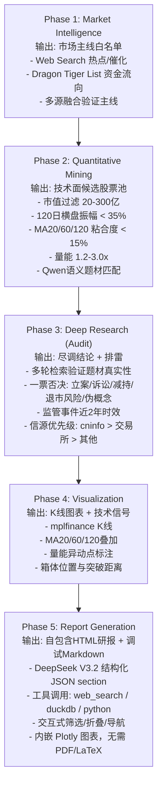

# Trend Agent - A股趋势跟踪与投资研究系统

一个遵循 **"重势、通过滤、待时机"** 理念的自动化投资研究流水线，通过五阶段处理将市场情报转化为可操作的研报。

---

## 理念概述

| 原则 | 含义 | 实现方式 |
|------|------|----------|
| **重势** | 跟踪市场主线，顺应资金趋势 | Web搜索提取热点 + 龙虎榜资金验证 |
| **通过滤** | 严格的量化筛选和审计排雷 | 技术指标过滤 + 多轮审计式尽调 |
| **待时机** | 等待确定性信号出现 | 横盘整理 + 温和放量 + 箱体上沿 |

---

## 五阶段流水线



---

## Phase 1: Market Intelligence (市场情报)

### 目标
提取当前市场的3-5个核心主线题材，并验证其有效性。

### 1a) Web Search - 新闻热点提取

**数据来源**: Zhipu AI Web Search

**搜索策略**:
```python
queries = [
    f"A股 {current_year_month} 核心题材 最新热点",
    f"龙虎榜 {current_year_month} 机构游资 重点板块 最新动向",
    f"A股 {current_year_month} 涨停复盘 市场热点",
]
```

**LLM处理**: DeepSeek V3.2 分析搜索结果，提取:
- 主题名称 (name)
- 关键词列表 (keywords)
- 摘要说明 (summary)
- 来源URL (sources)

**输出格式**:
```json
{
  "themes": [
    {
      "name": "AI应用",
      "keywords": ["AI营销", "端侧AI", "物理AI"],
      "summary": "大模型商业化加速，端侧部署成趋势...",
      "sources": ["url1", "url2"]
    }
  ],
  "market_summary": "当前市场围绕AI应用、低空经济..."
}
```

### 1b) Dragon Tiger List - 资金流向分析

**数据来源**: 本地 `data/top_list/YYYYMMDD.parquet`

**分析维度**:
- 上榜次数: 该主题股票在龙虎榜出现频率
- 累计净买入: 资金净流入/流出情况
- 热门股票: 该主题下最活跃的股票
- 资金结构: 北向资金、机构、游资占比
- 趋势判断: 资金流入/流出趋势

**行业聚合逻辑**:
```python
# 按行业聚合30日龙虎榜数据
for each day in last 30 days:
    load top_list/YYYYMMDD.parquet
    group by stock's industry
    sum: net_amount, l_buy, l_sell
    count: appearances
```

### 1c) Multi-Source Fusion - 多源融合

**核心思想**: Web搜索提供"情绪和催化"，龙虎榜提供"真实资金行为"

**融合原则**:
| validation_status | Web验证 | 资金验证 | 策略 |
|-------------------|---------|----------|------|
| `confirmed` | ✅ | ✅ | 重点布局，双轮驱动 |
| `web_only` | ✅ | ❌ | 观察中，等待资金入场 |
| `capital_only` | ❌ | ✅ | 潜在机会，深入挖掘逻辑 |
| `weak` | ❌ | ❌ | 不关注 |

**DeepSeek融合提示词结构**:
```
输入:
  - Web Search结果 (主题、关键词、摘要)
  - Dragon Tiger List结果 (上榜次数、净买入、资金结构)

输出:
  - validation_status: 4选1
  - summary: 综合Web+资金双方面证据
  - capital_signal: 资金行为总结
```

---

## Phase 2: Quantitative Mining (量化筛选)

### 目标
从5000+ A股中筛选出30-50只符合技术形态的候选股票。

### 筛选参数

| 参数 | 值 | 说明 |
|------|-----|------|
| 市值范围 | 20-300亿 | 避免大盘股和小微盘 |
| 最少交易日 | 120天 | 确保有足够历史数据 |
| 横盘观察期 | 120天 | 计算箱体振幅的时间窗口 |
| 最大振幅 | 35% | 横盘整理的波动上限 |
| 最小换手率 | 1.0% | 确保流动性 |
| 放量倍数 | 1.2-3.0x | 近期相对温和放量 |

### 技术指标详解

#### 1) 横盘得分 (Consolidation Score: 0-100)

```
得分 = 波动分 + MA粘合分 + MA稳定分 + 位置分 + 量能分

- 波动分 (40分): max(0, 1 - 振幅/0.35) × 40
- MA粘合分 (25分): max(0, 1 - MA价差/0.15) × 25
- MA稳定分 (5分): max(0, 1 - MA标准差/0.03) × 5
- 位置分 (20分): max(0, 1 - |位置-0.5|/0.2) × 20
- 量能分 (10分): max(0, (放量倍数-1)/0.5) × 10
```

#### 2) 均线系统 (MA Alignment)

- **MA20/60/120**: 计算均线价差
- **均线粘合度**: (max(MA) - min(MA)) / min(MA)
- **稳定性**: 近20天均线价差的标准差

#### 3) 量能分析 (Volume)

- **基准换手率**: 120日平均换手率
- **近期换手率**: 近10日平均换手率
- **放量倍数**: 近期 / 基准 (1.2-3.0x为理想区间)

#### 4) 价格位置 (Price Position)

```
位置 = (当前价 - 箱体底) / (箱体顶 - 箱体底)
- 0.4-0.6: 理想位置 (箱体中部)
- <0.3: 偏离底部
- >0.7: 接近箱体顶部
```

### DuckDB SQL 筛选

```sql
SELECT *
FROM screen
WHERE consolidation_score >= 70      -- 横盘得分高
  AND ma_spread <= 0.15              -- 均线粘合
  AND ma_spread_std <= 0.03          -- 均线稳定
  AND volume_boost >= 1.2            -- 有放量
  AND volume_boost <= 3.0            -- 但不是巨量
ORDER BY composite_score DESC
```

### Qwen 语义题材匹配

**目的**: 将筛选出的股票与Phase 1的主题进行语义匹配

**输入**:
- 市场主题白名单 (名称、关键词、摘要)
- 股票信息 (名称、行业、主营业务、经营范围、公司简介)

**LLM任务**:
```
给定题材白名单和股票业务简介，判断该股票是否属于白名单题材。
只允许从白名单里选择0-2个题材；不确定就返回空数组。

输出JSON:
{
  "matches": {
    "ts_code": ["theme1", "theme2"]
  },
  "notes": {
    "ts_code": "判断理由"
  }
}
```

**执行优化**:
- 每次基于当前主题集重新执行匹配，避免旧主题结果污染当前筛选
- 批处理: 每批8只股票（可通过运行时配置调整）
- 通过请求间隔与重试控制应对本地/远端模型限流

---

## Phase 3: Deep Research (审计级尽调)

### 目标
对候选股票进行多轮检索式尽调，排除"雷股"并验证题材真实性。

### 尽调流程

```
初始化
  ↓
Pass 1: 预设查询 (验证题材实锤 + 监管检查)
  ↓
Pass 2-3: DeepSeek规划查询 (基于已有证据动态规划)
  ↓
LLM判读 (pass/warn/fail)
  ↓
输出审计结果
```

### 检索策略

#### Pass 1: 预设查询

```python
queries = [
    f"{name} {theme} 实锤 订单 客户 概念",
    f"site:cninfo.com.cn {symbol} {name} 重大合同",
    f"site:cninfo.com.cn {symbol} {name} 监管函 问询函 处罚",
]
```

#### Pass 2-3: DeepSeek动态规划

**输入**: 已收集的证据摘要 (最近4条，最多2000字符)

**输出**:
```json
{
  "stop": false,           -- 是否停止检索
  "reason": "已找到确凿订单证据",  -- 停止原因
  "queries": [             -- 下一轮查询
    "site:cninfo.com.cn ...",
    "..."
  ]
}
```

### 一票否决 (Hard Veto)

| 类别 | 触发条件 | 说明 |
|------|----------|------|
| 立案调查 | `被.{0,12}立案` 或 `涉嫌.{0,12}立案` | 正式立案调查 |
| 重大诉讼 | `重大诉讼` 或 `未决诉讼` | 未结案的重大诉讼 |
| 减持计划 | `拟.{0,12}减持` 或 `减持计划` | 股东减持计划 |
| 退市风险 | `终止上市` 或 `退市风险警示` | 退市风险警示 |
| 伪概念 | 多轮检索无订单/客户/中标等硬证据 | 概念炒作无实质 |

### 监管事件时效性

| 严重程度 | 关键词 | 有效期 | 判定 |
|----------|--------|--------|------|
| 严重 | 行政处罚、纪律处分、公开谴责、市场禁入 | 730天 | Fail |
| 一般 | 监管函、问询函、关注函、责令改正 | 730天 | Warn (附加说明) |

**判断逻辑**:
```python
if match_severe_pattern() and is_recent(date, 730_days):
    verdict = "fail"
elif match_minor_pattern() and is_recent(date, 730_days):
    verdict = "warn"  # 添加风险提示
```

### 积极信号 (Positive Signals)

**关键词**: 订单、中标、客户、签约、签署、签订、合同、协议、合作、供货、落地、框架协议

**判断**:
```python
if has_positive_signals:
    verdict = "pass"  # 提前终止检索
elif executed_passes >= 2 and no_positive_signals:
    verdict = "fail"  -- 多轮检索无实锤，判定伪概念
```

### 信源优先级

1. **cninfo.com.cn** (巨潮资讯网) - 官方公告
2. **sse.com.cn** (上交所)
3. **szse.cn** (深交所)
4. 其他财经媒体

**降级规则**: 如果pass判定但缺少一级信源，降级为warn

### 输出格式

```python
AuditResult(
    ts_code="000001.SZ",
    name="平安银行",
    theme="AI金融",
    verdict="pass",  # pass | warn | fail
    rationale="检索到多项AI相关订单落地，无监管负面...",
    sources=["url1", "url2", ...]
)
```

---

## Phase 4: Visualization (可视化)

### 目标
生成K线图表，标注关键技术信号。

### K线图元素

| 元素 | 类型 | 说明 |
|------|------|------|
| K线 | candlestick | OHLC价格 |
| 成交量 | bar | 底部成交量柱 |
| MA20 | line | 橙色，20日均线 |
| MA60 | line | 蓝色，60日均线 |
| MA120 | line | 紫色，120日均线 |
| 量能异动 | scatter (^) | 红色三角，放量>1.5倍 |

### 量能异动检测

```python
def detect_turnover_spikes(df, window=20, multiple=1.5):
    rolling = df['turnover_rate'].rolling(window).mean()
    spikes = df['turnover_rate'] > (rolling * multiple)
    return spikes  # True/False Series
```

### 技术信号计算

| 信号 | 计算方式 | 用途 |
|------|----------|------|
| box_top | 120日最高价 | 箱体上沿 |
| box_bottom | 120日最低价 | 箱体下沿 |
| amplitude_120 | (顶-底)/底 | 横盘振幅 |
| close_position | (当前价-底)/(顶-底) | 价格位置 |
| turnover_mult | 近10日/120日平均换手 | 放量倍数 |
| ignition | 1.2 ≤ turnover_mult ≤ 3.0 | 点火信号 |
| ready_to_break | ignition 且 接近箱体顶 且 站上MA20 | 突破就绪 |

---

## Phase 5: Report Generation (研报生成)

### 目标
生成结构化、可操作的投资研究报告。

### DeepSeek工具调用

**支持工具**:
- `web_search`: 联网检索补充信息
- `duckdb`: 执行SQL查询数据
- `python`: 执行Python代码分析

**交互流程**:
```
用户发送任务 → DeepSeek生成回复
              ↓
          有工具调用?
              ↓ 是
      执行工具 → 返回结果 → DeepSeek继续
              ↓
          输出最终报告
```

### 报告结构

```markdown
# A股趋势跟踪研报

## 【市场风向标】

### AI应用 (confirmed)
- **主题逻辑**: 大模型商业化加速，端侧部署成趋势...
- **资金验证**: 上榜18次，累计净买入12.5亿，北上资金占比60%，资金持续流入
- **持续观察**: 关注大模型厂商合作进展、端侧AI落地情况

## 【核心金股】

| 股票 | 所属主线 | 形态特征 | 推荐理由 |
|------|----------|----------|----------|
| 平安银行(000001.SZ) | AI金融 | 横盘分85, 量能1.8 | 市值200亿, 换手2.5 |

## 【深度图解】

### 平安银行 000001.SZ

<font color='blue'>**【投资逻辑】**</font>
- **观察现象**: 横盘120日，近期温和放量1.8倍，均线(MA20>MA60>MA120)呈多头排列
- **分析意义**: 资金悄然吸筹，趋势向好，接近箱体上沿
- **验证方式**: 龙虎榜显示机构连续买入，财报显示AI业务收入增长35%
- **结论**: 强烈推荐 - 突破在即，资金认可度高

**【技术分析】**
- 横盘时长: 120天 | 波动率: 28%
- 量能信号: 近期放量1.8倍，温和资金入场
- 均线排列: MA20(15.2) > MA60(14.8) > MA120(14.5)，多头排列
- 箱体位置: 当前价15.8，距箱体顶16.2仅3%，突破在即

<font color='purple'>**【资金验证】**</font>
- 龙虎榜: 近30日上榜3次，机构净买入2.5亿
- 估值水平: PE 8.5，处于历史低位
- 市值适合度: 200亿，适合中等资金运作

<font color='red'>**【核心催化】**</font>
- 政策: 金融科技支持政策即将出台
- 事件: 公司AI中台即将上线，预计提升运营效率20%
- 市场: AI金融应用场景获得市场认可

<font color='green'>**【交易建议】**</font>
- **买入时机**: 突破箱体上沿16.2并回踩确认
- **仓位配置**: 首批15%，突破加仓20%，回踩支撑加仓25%
- **止盈止损**: 目标20%分批止盈，止损-15%严格执行
- **持仓周期**: 3-6个月，中期持股

<font color='orange'>**【风险提示】**</font>
- 核心风险: 系统性风险，大盘调整可能影响个股表现
- 应对措施: 严格止损，控制仓位，分批建仓

- 量能异动日：2024-12-15, 2024-12-28, 2025-01-05


- **尽调结论** (AI金融): pass
  - 说明: 检索到多项AI相关订单落地，无监管负面信息
  - 来源: [cninfo.com.cn](url1), [sse.com.cn](url2)

## 【风险提示】

<font color='orange'>- 题材轮动快，注意情绪退潮风险。</font>
<font color='orange'>- 量能异动需配合市场主线验证。</font>
<font color='orange'>- 若出现监管函、立案调查等硬伤，直接剔除。</font>
```

### HTML报告

**输出契约**: `reports/report_*.html` 为正式产物，`reports/report_*.md` 仅用于调试。

**特性**:
- 单文件自包含 HTML
- 内嵌 Plotly JS 与交互图表
- 主题/股票筛选、折叠、粘性导航
- 浏览器打印可作为 PDF fallback

---

## 数据架构

### 目录结构

```
trend-agent/
├── data/                          # 数据目录 (symlink)
│   ├── stock_basic/              # 股票基本信息
│   ├── stock_company/            # 公司信息
│   ├── stock_ticks/              # 历史行情 (每只股票一个parquet)
│   ├── financial/                # 财务数据
│   ├── top_list/                 # 龙虎榜汇总 (每日)
│   └── top_inst/                 # 龙虎榜明细 (每日)
│
├── charts/                        # 输出K线图
│   ├── 000001.SZ.png
│   └── ...
│
├── reports/                       # 输出研报
│   ├── report_20250123_120000.html
│   ├── report_20250123_120000.md    # 调试用
│   ├── audit_trace_*.jsonl       # 审计过程trace
│   └── deepseek_trace_*.jsonl    # 报告生成trace
│
└── .cache/                        # 缓存
    └── qwen_theme_match.json     # 题材匹配缓存
```

### 数据Schema

#### stock_ticks/{ts_code}.parquet

| 列名 | 类型 | 说明 |
|------|------|------|
| ts_code | str | 股票代码 |
| trade_date | str | 交易日期 YYYYMMDD |
| open/high/low/close | float | OHLC价格 |
| vol | float | 成交量 (手) |
| amount | float | 成交额 (元) |
| turnover_rate | float | 换手率 (%) |
| pe/pb | float | 估值指标 |
| total_mv | float | 总市值 (元) |

#### top_list/YYYYMMDD.parquet

| 列名 | 类型 | 说明 |
|------|------|------|
| ts_code | str | 股票代码 |
| name | str | 股票名称 |
| trade_date | str | 交易日期 |
| close | float | 收盘价 |
| pct_change | float | 涨跌幅 (%) |
| turnover_rate | float | 换手率 (%) |
| l_buy | float | 买入额 (元) |
| l_sell | float | 卖出额 (元) |
| net_amount | float | 净买入 (元) |
| amount_rate | float | 买入占比 (%) |
| reason | str | 上榜原因 |

---

## 环境配置

### Python环境

```bash
python -m venv .venv
source .venv/bin/activate
pip install -U pandas numpy duckdb mplfinance matplotlib \
               langchain-core langchain-community python-dotenv
```

### 系统依赖

无额外 PDF/LaTeX 依赖；HTML 报告直接由 Python 生成。

### 环境变量 (.env)

```env
# Zhipu AI (Web Search)
ZHIPUAI_API_KEY=xxx
ZHIPU_SEARCH_COUNT=15

# SiliconFlow (DeepSeek/Qwen)
SILICONFLOW_BASE_URL=https://api.siliconflow.cn/v1
SILICONFLOW_API_KEY=sk-xxx
DEEPSEEK_MODEL=Pro/deepseek-ai/DeepSeek-V3.2
QWEN_MODEL=Qwen/Qwen3-8B

# Debug Flags
DEBUG_DEEPSEEK=0
DEBUG_ZHIPU_SEARCH=0
DEBUG_SILICONFLOW=0

# Strategy Parameters
REGULATORY_MAX_AGE_DAYS=730
HOLDING_HORIZON=swing_2_8w
TOPLIST_EXCLUSION_MODE=penalty
TOPLIST_PENALTY_WEIGHT=0.25
TOPLIST_LOOKBACK_DAYS=60
TOPLIST_CROWDED_MIN_HITS=4
HARD_FAIL_REQUIRE_RECENCY=1
HARD_FAIL_MAX_AGE_DAYS=730
HARD_FAIL_REDUCE_MATERIALITY_THRESHOLD=0.03
THEME_MATCH_POLICY=conservative
MAX_NAMES_PER_THEME=4
MAX_NAMES_PER_INDUSTRY=4

# Qwen Theme Match Rate-Limit Controls (Phase 2)
QWEN_BATCH_SIZE=4
QWEN_RATE_LIMIT_MAX_RETRIES=6
QWEN_RATE_LIMIT_BASE_DELAY_SEC=1.0
QWEN_RATE_LIMIT_MAX_DELAY_SEC=20.0
QWEN_REQUEST_INTERVAL_SEC=0.35
```

说明:
- 当Qwen在批次匹配中持续返回`429`并耗尽重试后，系统会对该批次降级为空匹配（`rate_limited_exhausted`），流水线继续执行并进入既有heuristic/off-theme fallback逻辑。
- 默认采用“可靠性优先”策略：更小批次 + 请求节流 + 指数退避，降低TPM突发峰值导致的整体失败概率。

---

## 使用指南

### 运行完整流水线

```bash
source .venv/bin/activate
python trend_agent.py
```

### 单独运行各模块

```bash
# 仅技术筛选
python screen_growth_stocks.py

# 检查环境
python check_setup.py

# 测试DeepSeek思维模式
python test_deepseek_thinking.py

# 离线评估候选池（5/10/20日收益 + 消融）
python strategy_evaluator.py --candidates reports/candidates_YYYYMMDD_HHMMSS.csv
```

### 调试模式

```bash
export DEBUG_DEEPSEEK=1
export DEBUG_ZHIPU_SEARCH=1
python trend_agent.py
```

---

## 输出示例

### 1) K线图 (charts/{ts_code}.png)

- 240日K线 + 成交量
- MA20(橙) / MA60(蓝) / MA120(紫) 叠加
- 量能异动日标注 (红色三角)
- 中文标题

### 2) HTML研报 (reports/report_*.html)

- 单文件自包含
- 交互式筛选、折叠、导航
- 内嵌 Plotly 图表
- 浏览器可直接打印导出

### 3) Debug Markdown (reports/report_*.md)

- 与 HTML 同源的调试输出
- 无 PDF 专用格式处理
- 便于快速 diff 和排查 LLM 输出

### 4) Trace文件

- `audit_trace_*.jsonl`: 审计过程完整记录
- `deepseek_trace_*.jsonl`: 报告生成工具调用记录

---

## 投资指引 (仅供参考)

### 仓位管理

| 买入阶段 | 仓位 | 条件 |
|----------|------|------|
| 首批建仓 | 15% | 突破箱体上沿 |
| 突破加仓 | 20% | 回踩确认不破 |
| 回踩加仓 | 25% | 触及MA20支撑 |

### 止盈止损

- **止盈**: +30% 分批止盈
- **止损**: -15% 严格执行
- **持仓周期**: 3-6个月

### 风险控制

1. 不追高，等待回踩
2. 严格止损，不抱侥幸
3. 控制仓位，不赌单只
4. 分散配置，相关度低的3-5只

---

## 免责声明

本工具及生成的研报仅供学习研究使用，不构成任何投资建议。股市有风险，投资需谨慎。

---

## 常见问题

### Q: HTML报告打开后没有交互图表？

A: 检查浏览器是否禁用了页面脚本，或确认生成的 `report_*.html` 文件没有被截断。

### Q: Zhipu搜索报错？

A: 检查API Key和网络连接:
```bash
export ZHIPUAI_API_KEY=xxx
export DEBUG_ZHIPU_SEARCH=1
```

### Q: 数据文件缺失？

A: 确保 `data/` 符号链接指向正确的数据目录，并验证Parquet文件存在。

### Q: 字体显示问题？

A: 系统需要中文字体，项目会尝试自动加载 `Source Han Sans CN`，可通过 `CHART_FONT` 环境变量自定义。

---

## 版本历史

- **v2.0** - 多源融合 (Web + Dragon Tiger List)
- **v1.5** - DeepSeek V3.2思维模式支持
- **v1.0** - 初始版本，五阶段流水线
