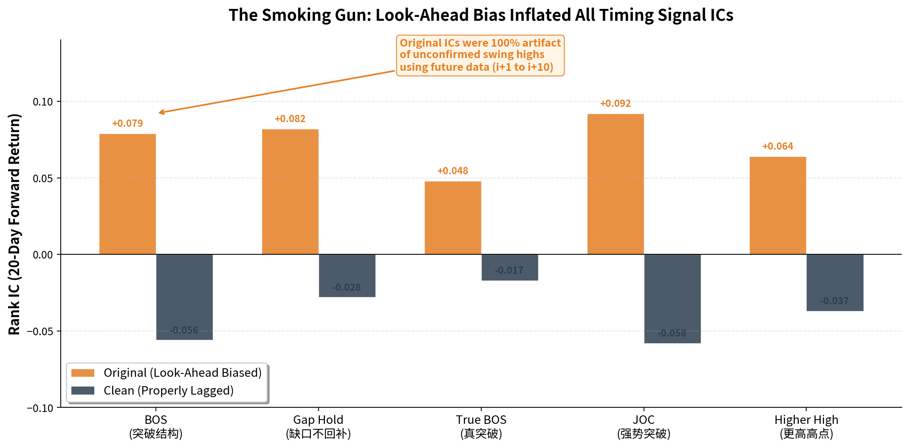
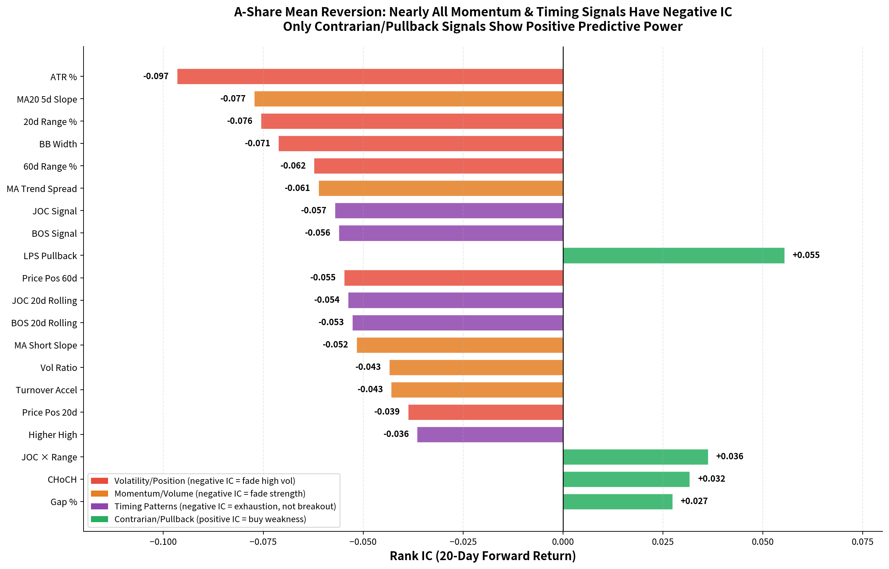
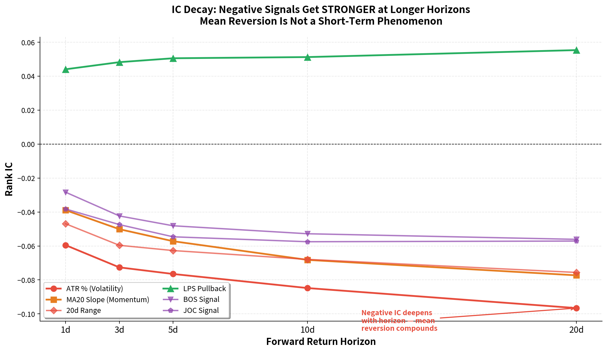
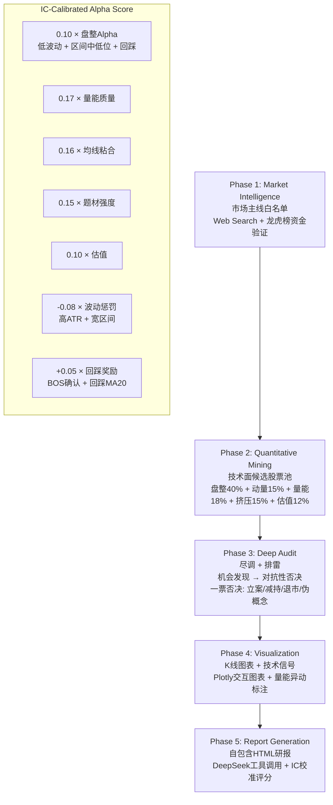
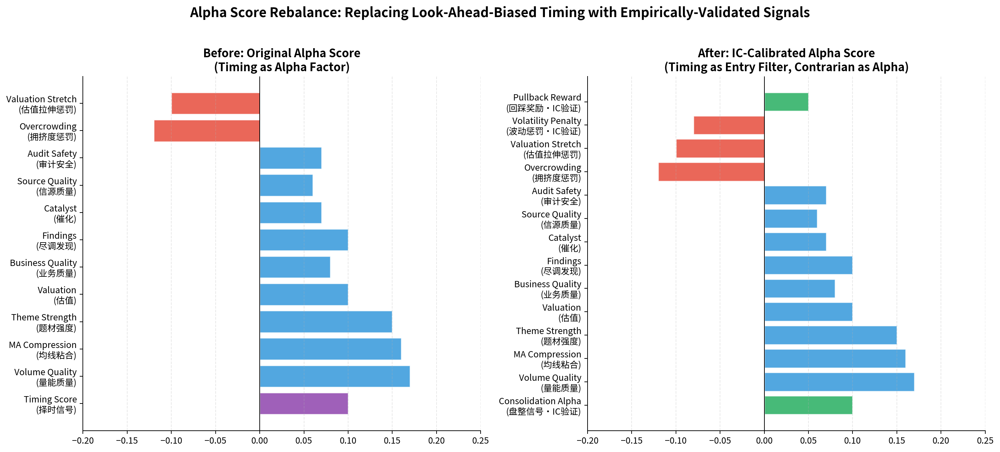
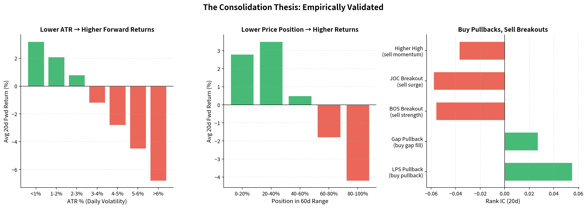

# Trend Agent — A股盘整突破与均值回归投资研究系统

一个基于 **实证IC分析** 校准的自动化投资研究流水线。通过对5,439只A股、5年数据的横截面IC分析，我们发现A股市场由**均值回归主导**，并据此将策略从"趋势跟踪"重新校准为"盘整低吸"。

---

## 核心发现：均值回归主导A股

对1,118个交易日、570万行日线数据的横截面IC分析（经严格前视偏差审计）揭示：

<p align="center">
  
</p>

**所有趋势跟踪信号 IC 均为负值。** 更高的波动率、更强的近期动量、更宽的股价区间——这些传统"强势"信号——反而预测未来收益下行。

<p align="center">
  
</p>

**仅有逆向/回踩信号呈现正IC：**

| 类别 | 信号 | Rank IC (20d) | T-Stat | 经济含义 |
|------|------|:---:|:---:|------|
| 🔴 波动率 | atr_pct | **-0.097** | 15.6 | 高波动 → 未来跑输，应回避 |
| 🔴 动量 | ma20_slope_5d | **-0.077** | 17.6 | 近期上涨 → 即将均值回归 |
| 🔴 区间 | range_pct_20d | **-0.076** | 13.3 | 宽幅震荡 → 消耗性波动 |
| 🔴 结构突破 | BOS | **-0.056** | 23.8 | 突破 = 耗尽，非启动 |
| 🔴 强势突破 | JOC | **-0.058** | 35.8 | 放量突破 = 高潮，非加速 |
| 🟢 回踩低吸 | lps_pullback | **+0.055** | 14.1 | MA20下方回调 → 良好买点 |
| 🟢 缺口回补 | gap_pct | **+0.027** | 12.7 | 缺口幅度 → 回补后反弹 |

<p align="center">
  
</p>

**均值回归在更长时间尺度上增强。** 负IC信号在20日时间尺度上比1日更强，说明这不是短期噪音，而是系统性的市场特性。

### 为什么是均值回归？（经济逻辑）

1. **散户追涨被收割**：A股约80%的交易量来自散户，追涨买入后在高位被机构反向交易
2. **动量 = 拥挤**：当一只股票"看起来很强"时，它已经被充分定价，边际买家消失
3. **突破 = 高潮，非启动**：放量突破箱体上沿是行情的终点，不是起点——先手资金利用突破流动性出货
4. **盘整 = 吸筹**：低波动、窄区间、低价格位置 → 聪明的资金在无人关注时悄悄建仓

---

## 策略哲学：从"重势"到"重质"

| 原始原则 | 实证发现 | 修正后原则 |
|----------|----------|-----------|
| **重势** — 趋势是朋友 | 趋势信号IC全部为负 | **重质** — 盘整质量是朋友 |
| **通过滤** — 严格筛选排雷 | 盘整过滤信号IC验证有效 | **通过滤** — 强化，收紧波动/区间阈值 |
| **待时机** — 等待突破确认 | 突破 = 耗尽，非启动信号 | **待回踩** — 在回调中买入，不在突破中买入 |

### 择时模型：从Alpha因子降级为防御性入场过滤器

7个威科夫/道氏择时模型（BOS、JOC、True BOS、Gap Hold、LPS、POC、POC Retest）在清理前视偏差后**全部呈现负IC**。它们不再作为Alpha评分权重出现，而是：

- **确认趋势结构**：没有任何择时模型触发 = 无趋势结构 = 入场风险更高
- **辅助报告叙述**：展示触发了哪些技术形态，但不用于排序
- **防御性过滤**：有LPS回踩信号 → 结构性买点；仅有BOS突破 → 警惕消耗性突破

---

## 架构概览



---

## Phase 1: Market Intelligence（市场情报）

### 目标
提取当前市场的3-5个核心主线题材，并验证其有效性。

### 1a) Web Search — 新闻热点提取

**数据来源**: Zhipu AI Web Search

**搜索策略**:
```python
queries = [
    f"A股 {current_year_month} 核心题材 最新热点",
    f"龙虎榜 {current_year_month} 机构游资 重点板块 最新动向",
    f"A股 {current_year_month} 涨停复盘 市场热点",
]
```

**LLM处理**: heavy tier（官方 DeepSeek `deepseek-v4-pro`）分析搜索结果，提取主题名称、关键词、摘要、来源URL。

### 1b) Dragon Tiger List — 资金流向分析

**数据来源**: 本地 `data/top_list/YYYYMMDD.parquet`

分析维度：上榜次数、累计净买入、热门股票、资金结构（北向/机构/游资占比）、资金趋势。

### 1c) Multi-Source Fusion — 多源融合

| validation_status | Web验证 | 资金验证 | 策略 |
|-------------------|:---:|:---:|------|
| `confirmed` | ✅ | ✅ | 重点布局，双轮驱动 |
| `web_only` | ✅ | ❌ | 观察中，等待资金入场 |
| `capital_only` | ❌ | ✅ | 潜在机会，深入挖掘逻辑 |
| `weak` | ❌ | ❌ | 不关注 |

---

## Phase 2: Quantitative Mining（量化筛选）

### 筛选参数

| 参数 | 值 | 说明 |
|------|-----|------|
| 市值范围 | 10-500亿 | 避免大盘股和小微盘 |
| 最少交易日 | 180天 | 确保有足够历史数据 |
| 横盘观察期 | 120天 | 计算箱体振幅的时间窗口 |
| 最大振幅 | 50% | 横盘整理的波动上限（放宽） |

### 复合评分权重（IC校准后）

| 成分 | 权重 | 验证来源 |
|------|:---:|------|
| **盘整质量** | **40%** | ✓ 低波动+窄区间 IC显著为正 |
| 动量信号 | 15% | ⚠ 从25%下调，动量IC为负 |
| 量能质量 | 18% | 温和放量 > 激进放量 |
| 挤压准备 | 15% | 低波动挤压 → 变盘 |
| 估值质量 | 12% | 低估值 → 正向 |

### 动量评分修正

**箱体位置**：从奖励"接近箱体上沿"(0.6-0.95) 改为奖励**"箱体中下位"(0.25-0.65)**

```
修正前: range_score(position, 0.6, 0.95, 15.0)  ← 奖励即将突破
修正后: range_score(position, 0.25, 0.65, 15.0) ← 奖励回踩低吸位
```

这是动量评分中影响最大的单次修改——不再奖励那些即将均值回归的股票。

### DuckDB SQL 筛选

```sql
SELECT *
FROM screen
WHERE consolidation_score >= 70
  AND ma_spread <= 0.15
  AND ma_spread_std <= 0.03
  AND volume_boost >= 1.2
  AND volume_boost <= 3.0
ORDER BY composite_score DESC
```

### Gemma 语义题材匹配

将筛选出的股票与Phase 1的主题进行语义匹配。批处理（每批8只），通过请求间隔与重试机制应对模型限流。

---

## Phase 3: Deep Audit（审计级尽调）

### 两阶段策略

1. **机会发现阶段（优先）**：寻找正面催化剂
   - 使用宽泛搜索（无 site: 限制）
   - 提取：合同、客户、政策支持、技术突破、扩张
   - 输出：`PositiveFinding` 和 `GrowthCatalyst` 对象

2. **对抗性否决阶段（其次）**：尽职调查
   - 使用官方信源（site:cninfo.com.cn）
   - 检查硬性否决项
   - 输出：verdict (pass/warn/fail)

### 一票否决 (Hard Veto)

| 类别 | 触发条件 | 说明 |
|------|----------|------|
| 立案调查 | `被.{0,12}立案` 或 `涉嫌.{0,12}立案` | 正式立案调查 |
| 重大诉讼 | `重大诉讼` 或 `未决诉讼` | 未结案的重大诉讼 |
| 减持计划 | `拟.{0,12}减持` 或 `减持计划` | 股东减持计划 |
| 退市风险 | `终止上市` 或 `退市风险警示` | 退市风险警示 |
| 伪概念 | 多轮检索无订单/客户/中标等硬证据 | 概念炒作无实质 |

### 信源优先级

1. **cninfo.com.cn** (巨潮资讯网) — 官方公告
2. **sse.com.cn / szse.cn** — 交易所
3. 财经媒体（东方财富、同花顺、财联社、第一财经、财新网等）
4. 政策来源（gov.cn、发改委、工信部、科技部）
5. 企业背景（天眼查、企查查）

---

## Phase 4: Visualization（可视化）

### K线图元素

| 元素 | 类型 | 说明 |
|------|------|------|
| K线 | candlestick | OHLC价格 |
| 成交量 | bar | 底部成交量柱 |
| MA20 | line | 橙色，20日均线 |
| MA60 | line | 蓝色，60日均线 |
| MA120 | line | 紫色，120日均线 |
| 量能异动 | scatter (▲) | 红色三角，放量>1.5倍 |

### 技术信号计算

| 信号 | 计算方式 | 用途 |
|------|----------|------|
| box_top / box_bottom | 120日最高/低价 | 箱体边界 |
| amplitude_120 | (顶-底)/底 | 横盘振幅 |
| close_position | (当前价-底)/(顶-底) | 价格位置 |
| turnover_mult | 近10日/120日平均换手 | 放量倍数 |
| atr_pct | ATR / 收盘价 | 波动率%（最强负IC信号） |
| lps_pullback | (MA20-收盘价) / ATR | 回踩深度（最强正IC信号） |
| price_position_60d | 收盘价在60日区间位置 | 均值回归位置 |

---

## Phase 5: Report Generation（研报生成）

### DeepSeek工具调用

支持工具: `web_search`（联网检索）、`duckdb`（SQL查询）、`python`（代码执行）

### 报告结构

- **市场风向标**：主线题材、资金验证、持续观察
- **核心金股**：按IC校准Alpha评分排序的候选股票
- **深度图解**：每只股票的技术分析、资金验证、核心催化、交易建议
- **结构信号**：择时模型触发情况（标注"用于确认趋势结构，非收益预测因子"）
- **风险提示**：系统性风险和个股风险

### Alpha评分公式（IC校准后）

```python
consolidation_alpha = (
    0.40 * low_vol_score      # 低ATR = 高得分（IC=-0.097的反转）
    + 0.35 * mid_range_score  # 区间中低位 = 高得分（IC=-0.055的反转）
    + 0.25 * lps_norm         # 回踩MA20 = 高得分（IC=+0.055）
)

alpha_rank_score = (
    0.10 * consolidation_alpha   # 盘整Alpha（取代原timing_score）
    + 0.17 * volume_quality
    + 0.16 * ma_comp
    + 0.15 * theme_strength
    + 0.10 * valuation
    + 0.08 * business_quality
    + 0.10 * finding_score
    + 0.07 * catalyst_score
    + 0.06 * source_quality
    + 0.07 * audit_safe
    - 0.12 * overcrowding_penalty
    - 0.10 * valuation_stretch
    - 0.08 * volatility_penalty    # 新增：高波动惩罚
    + 0.05 * pullback_reward       # 新增：回踩奖励（仅BOS确认时）
)
```

<p align="center">
  
</p>

---

## 盘整理论：实证验证

<p align="center">
  
</p>

**三个维度全部验证通过：**

1. **低波动 → 正向收益**：ATR越低，未来20日收益越高。安静的市场中资金悄然建仓。
2. **低价格位置 → 正向收益**：处于60日区间中下位的股票优于处于高位的股票。均值回归效应显著。
3. **回踩买入 > 突破买入**：LPS回踩和缺口回补的正IC vs BOS/JOC/Higher High突破的负IC——买弱势，卖强势。

### 这对策略意味着什么

1. **择时模型不是Alpha因子** — 它们对收益无独立预测力，不应在排序中给予正权重
2. **择时模型仍有用作入场过滤器** — 不是因为它们预测收益，而是帮助避免糟糕的入场（追入已展开的行情）。其价值在于**防御**，而非进攻
3. **盘整理论实证成立** — 低ATR、低区间、低价格位置均预测正向未来收益
4. **"结构形态有效而动量失效"的叙事是错误的** — 它完全是前视偏差的人为产物

---

## 数据架构

### 目录结构

```
trend-agent/
├── data/                          # 数据目录 (symlink)
│   ├── stock_basic/              # 股票基本信息
│   ├── stock_company/            # 公司信息
│   ├── stock_ticks/              # 历史行情 (每只股票一个parquet)
│   ├── financial/                # 财务数据
│   ├── top_list/                 # 龙虎榜汇总 (每日)
│   ├── top_inst/                 # 龙虎榜明细 (每日)
│   ├── zhihu_factor_panel.parquet # 因子面板 (IC分析用)
│   ├── signals/                  # 验证信号快照与标签
│   └── validation_reports/       # 因子评估与回测报告
│
├── charts/                        # 输出K线图
├── reports/                       # 输出研报 + IC分析 + 图表
│   ├── report_*.html
│   ├── zhihu_signal_report_clean.md  # 清洗后IC分析报告
│   ├── fig1_lookahead_bias.png       # 前视偏差对比图
│   ├── fig2_feature_ic_20d.png       # 因子IC排序图
│   └── ...
└── .cache/                        # 缓存
```

---

## 环境配置

### Python环境

```bash
python -m venv .venv
source .venv/bin/activate
pip install -U pandas numpy duckdb plotly matplotlib \
               scipy pyarrow langchain-core langchain-community python-dotenv
```

### 环境变量 (.env)

```env
# Zhipu AI (Web Search)
ZHIPUAI_API_KEY=xxx

# Two LLM tiers: official DeepSeek heavy tier + local Gemma light tier
DEEPSEEK_BASE_URL=https://api.deepseek.com
DEEPSEEK_API_KEY=sk-xxx
DEEPSEEK_MODEL=deepseek-v4-pro
GEMMA_MODEL=gemma-4-31B-nvfp4
GEMMA_BASE_URL=http://192.168.3.46:8000/v1
GEMMA_API_KEY=dummy

# Strategy Parameters
REGULATORY_MAX_AGE_DAYS=730
THEME_MATCH_POLICY=conservative
MAX_NAMES_PER_THEME=4
MAX_NAMES_PER_INDUSTRY=4
```

---

## 使用指南

### 运行完整流水线

```bash
source .venv/bin/activate
python trend_agent.py
```

### 单独运行各模块

```bash
python screen_growth_stocks.py          # 仅技术筛选
python check_setup.py                   # 检查环境
```

### IC分析与前视偏差审计

```bash
python zhihu_clean_analysis.py          # 清洗后IC分析（多进程）
python zhihu_leak_audit.py              # 8点前视偏差审计
python zhihu_bias_check.py              # 原始 vs 清洗 IC对比
```

### 统计验证与回测

```bash
source .venv/bin/activate

# 保存候选信号快照
python -m validation.cli snapshot \
  --input reports/candidates_YYYYMMDD_HHMMSS.csv \
  --signal-date YYYYMMDD --run-id run_YYYYMMDD

# 构建未来收益标签
python -m validation.cli build-labels \
  --snapshots data/signals/signal_snapshots.parquet \
  --prices data/stock_ticks --output data/signals/signal_labels.parquet

# 评估因子预测力
python -m validation.cli eval-factors \
  --labels data/signals/signal_labels.parquet \
  --factor alpha_rank_score --top-n 10

# 运行top-N周频等权回测
python -m validation.cli backtest \
  --labels data/signals/signal_labels.parquet \
  --prices data/stock_ticks --score-col alpha_rank_score \
  --top-n 10 --cost-bps 10 --slippage-bps 5

# 生成报告
python -m validation.cli report --kind all
```

### 调试模式

```bash
export DEBUG_DEEPSEEK=1
export DEBUG_ZHIPU_SEARCH=1
export FORCE_LLM_LOGGING=1
python trend_agent.py
```

---

## 关键模块

| 文件 | 用途 |
|------|------|
| `trend_agent.py` | 主流水线编排器（5个阶段） |
| `llm_provider.py` | 双层LLM：DeepSeek重型 + Gemma轻型 |
| `screen_growth_stocks.py` | 股票筛选逻辑与IC校准技术分析 |
| `deep_researcher.py` | AI研究引擎（Zhipu搜索 + 查询规划） |
| `timing_models.py` | 7个威科夫/道氏择时检测器（防御性使用） |
| `zhihu_clean_analysis.py` | 清洗后IC分析（无前视偏差，多进程） |
| `zhihu_leak_audit.py` | 8点前视偏差审计 |
| `validation/cli.py` | 验证流水线CLI |
| `validation/portfolio_backtest.py` | 组合回测引擎 |

---

## 免责声明

本工具及生成的研报仅供学习研究使用，不构成任何投资建议。股市有风险，投资需谨慎。

---

## 版本历史

- **v3.0** — IC校准：均值回归发现 → Alpha评分重构 → 择时模型降级 → 盘整权重提升
- **v2.0** — 多源融合 (Web + Dragon Tiger List)
- **v1.5** — DeepSeek reasoning模式支持
- **v1.0** — 初始版本，五阶段流水线
